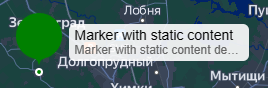

# YandexMapDefaultMarker

Компонент подгружает модуль `@yandex/ymaps3-markers@0.0.1`, принимает
в `settings` [YMapDefaultMarkerProps](https://yandex.ru/dev/jsapi30/doc/ru/ref/#YMapDefaultMarkerProps) и является
маркером с предустановленными настройками стилей.

::: info Важно
Параметр в `settings` `coordinates` является обязательным к указанию.
:::

## Примеры использования

- [Маркер с дизайном по умолчанию](/examples/objects/default-marker)
